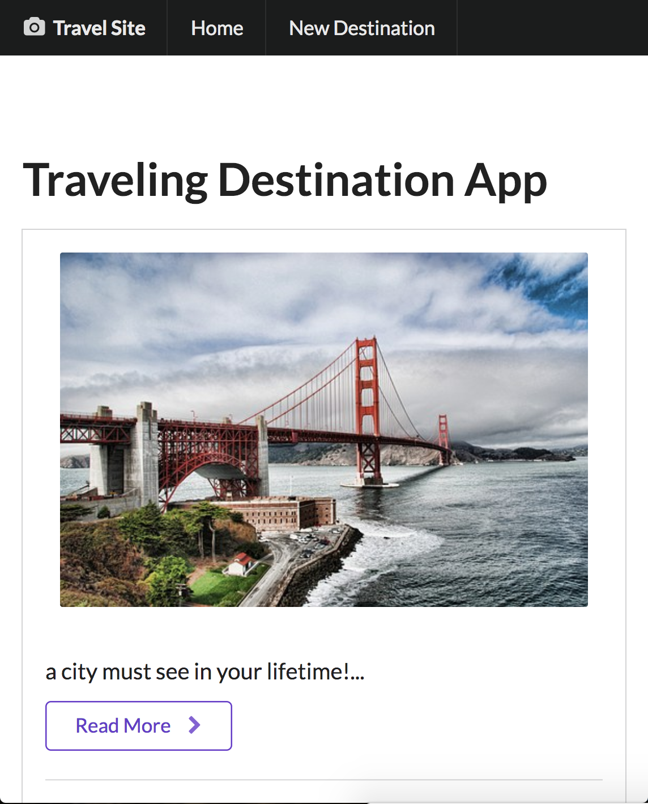

# Traveling Destination App

A traveling destination app using RESTful API architecture, backed up by Mongo database. A user can add a city they want to travel, edit that city's info and delete a city.

## How to run

run `node app.js`